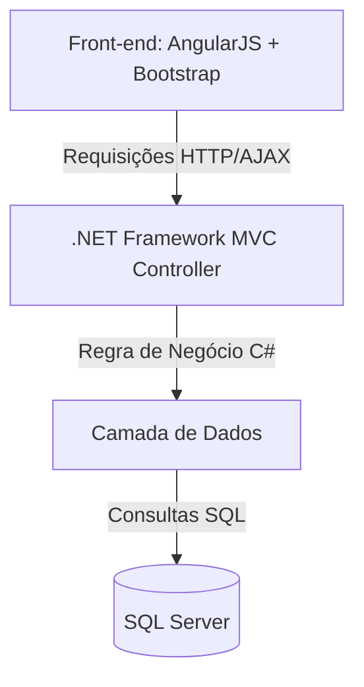

# ⏳ Timer Pomodoro

  

    Aplicação web para gestão de tempo e produtividade utilizando a técnica Pomodoro.
     
    <i>Desenvolvido na MOVERE Software</i>
  

  <!-- Badges de Tecnologias -->
  

    
    
    
    
    
    
    
  

  <!-- Badges de Status -->
  

    
    
  

---

> ⚠️ **Aviso:** Este projeto está atualmente em **fase de desenvolvimento**. Funcionalidades e rotas podem sofrer alterações até a versão final.

---

## 📌 Sobre o Projeto

O **Timer Pomodoro** foi idealizado para auxiliar no foco e no controle de ciclos de trabalho/estudo, permitindo que o usuário acompanhe seus intervalos de foco, pausas curtas e pausas longas, armazenando o histórico de ciclos para análise de desempenho.

### 🛠️ Arquitetura e Fluxo

✨ Funcionalidades
[x] Contagem regressiva para sessões de Foco (25 min)

[x] Contagem regressiva para Pausa Curta (5 min) e Pausa Longa (15 min)

[x] Notificações sonoras e visuais ao finalizar um ciclo

[x] Registro de sessões no banco de dados (SQL Server)

[x] Histórico e relatório de produtividade do usuário

[ ] Personalização do tempo de cada ciclo

🚀 Como Executar o Projeto

Pré-requisitos
Visual Studio (com suporte a .NET Framework MVC)
SQL Server / SSMS (SQL Server Management Studio)
IIS Express (integrado ao Visual Studio)

Passos para Instalação

Clonar o Repositório:
git clone [https://github.com/Marceloexe/TimerPomodoro.git](https://github.com/Marceloexe/TimerPomodoro.git)

Configurar o Banco de Dados:
Abra o SQL Server e execute o script de migração contido em /Database/script.sql.

Atualize a string de conexão no arquivo Web.config:
<connectionStrings>
  <add name="PomodoroConn" connectionString="Data Source=localhost;Initial Catalog=PomodoroDB;Integrated Security=True;" providerName="System.Data.SqlClient" />
</connectionStrings>

Executar a Aplicação:

Abra a solução .sln no Visual Studio.
Restaure os pacotes NuGet.
Pressione F5 para compilar e rodar a aplicação via IIS Express.

📁 Estrutura do Projeto
TimerPomodoro/
├── Controllers/         # Controllers .NET MVC (C#)
├── Models/              # Modelos de dados e entidades
├── Views/               # Views Razor e HTML
├── Scripts/             # Controladores e Serviços AngularJS
│   ├── app.js
│   └── controllers/
├── Content/             # Arquivos CSS e Bootstrap
└── Database/            # Scripts SQL Server

🤝 Contribuição e Organização
Desenvolvido como projeto interno na MOVERE Software.
